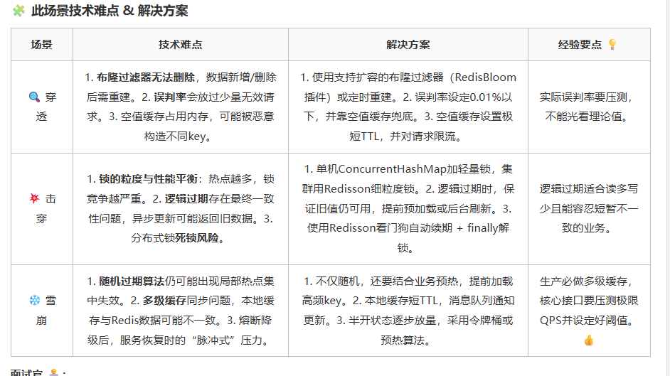

5. 如何保证Mysql和Redis双写一致性
🚫 绝不更新缓存，只删除缓存，用删除的幂等性避免并发写覆盖。
⏳ 所有缓存都要有过期时间，即使所有同步机制都失败，过期时间也能兜底。
📭 异步重试 + 消息补偿，保证最终一致性，别为了强一致牺牲可用性。
方案选型看业务容忍度：

场景	方案	一致性
普通读多写少	先更DB + 删缓存 + 延迟双删	最终一致（窗口极小）
跨系统/复杂更新	Binlog + MQ 异步刷新	最终一致（百毫秒延迟）
资金/库存核心链路	短TTL缓存 + 依赖DB事务	强一致
以上就是我们生产环境验证过的整套思路。”

4. 介绍一下Redis的缓存穿透击穿雪崩
问题类型	核心特征	典型触发场景	核心解决方案
缓存穿透	查不存在的数据	恶意攻击、参数非法	布隆过滤器、空值缓存
缓存击穿	单个热点 key过期	秒杀、爆款商品、热搜	互斥锁、逻辑过期
缓存雪崩	大量 key同时过期 / Redis 宕机	批量导入数据、集群故障	随机过期时间、高可用集群、熔断降级

🧩 此场景技术难点 & 解决方案
场景	技术难点	解决方案	经验要点 💡
🔍 穿透	1. 布隆过滤器无法删除，数据新增/删除后需重建。2. 误判率会放过少量无效请求。3. 空值缓存占用内存，可能被恶意构造不同key。	1. 使用支持扩容的布隆过滤器（RedisBloom插件）或定时重建。2. 误判率设定0.01%以下，并靠空值缓存兜底。3. 空值缓存设置极短TTL，并对请求限流。	实际误判率要压测，不能光看理论值。
💥 击穿	1. 锁的粒度与性能平衡：热点越多，锁竞争越严重。2. 逻辑过期存在最终一致性问题，异步更新可能返回旧数据。3. 分布式锁死锁风险。	1. 单机ConcurrentHashMap加轻量锁，集群用Redisson细粒度锁。2. 逻辑过期时，保证旧值仍可用，提前预加载或后台刷新。3. 使用Redisson看门狗自动续期 + finally解锁。	逻辑过期适合读多写少且能容忍短暂不一致的业务。
❄️ 雪崩	1. 随机过期算法仍可能出现局部热点集中失效。2. 多级缓存同步问题，本地缓存与Redis数据可能不一致。3. 熔断降级后，服务恢复时的“脉冲式”压力。	1. 不仅随机，还要结合业务预热，提前加载高频key。2. 本地缓存短TTL，消息队列通知更新。3. 半开状态逐步放量，采用令牌桶或预热算法。	生产必做多级缓存，核心接口要压测极限QPS并设定好阈值。 👍
